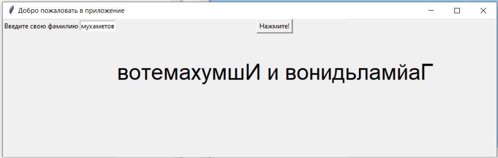

Гаймальдинов и Ишмухаметов

**Вопрос-ответ:**
1. Сколько источников было в файле Links.md в коммите
ad884917523dad20f0e7e25a67283acd80a1cf61
Ответ: 3 + 1 мем (жиза)

2. Какой коммит добавил в репозиторий файл 1984.md
Ответ: 618666f (Add 1984.md)

3. Запишите количество тэгов
Ответ: ноль :)

4. Запустите run.py по commit-hash помеченному тэгом v.0.1, запишите результат
выполнения
Ответ: Тега нет, но файл запустили. Результат:

